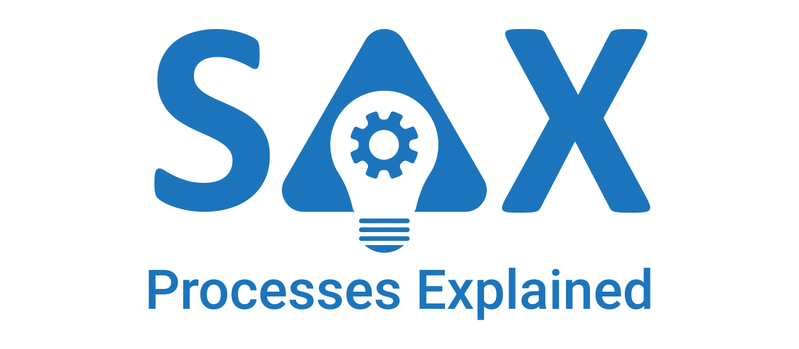

# SAX4BPM



**This is a designated Python library that aims to provide an easy and intuitive way of deriving explanations about business processes, considering multiple perspectives. Concretely, three major knowledge ingredients—a process model, a causal process model, and XAI attribute ranking—are derived and subsequently synthesized by an LLM for the construction of process and context-aware explanations, namely Situation-aware Explanations (SAX explanations).**


<p align="center">

</p>


## APIs

[//]: # "See https://gist.github.com/azagniotov/a4b16faf0febd12efbc6c3d7370383a6"

#### SAX endpoint: Get causal dependencies

<details>
 <summary><code>GET</code> <code><b>/sax/causalGraph</b></code> <code>(Endpoint to get the causal graph for a given variant and modality.)</code></summary>

##### Parameters

> | name               | type     | data type | description                                                                     |
> | ------------------ | -------- | --------- | --------------------------------------------------------------------------------|
> | `variant_name`     | mandatory | string   | The name of the variant (or ALL for all the variants)                           |
> | `modality`         | mandatory | string   | The modality of causal graph ('Chain' or 'Parent')                              |
> | `prior_knowledge`  | optional  | boolean  | Flag indicating whether prior knowledge should be used in the discovery process |
> | `p_value_threshold`| optional  | boolean  | The threshold value for p-value -filtering dependencies                         |

##### Responses

> | http code | content-type       | response                                                                                   |
> | --------- | -----------------  | ------------------------------------------------------------------------------------------ |
> | `200`     | `application/json` | `[{"from": "Activity1","items": 1.2673890630403917,"to": "Activity2"},...]`  |
> | `422`     | `application/json` | `{"message": "Error"}`                                                                     |
> | `500`     | `application/json` | `{"message": "Error"}`                                                                     |


##### Example cURL

> ```javascript
>  curl -X GET "http://127.0.0.1:9010/sax/causalGraph?variant_name=ALL&modality=CHAIN&prior_knowledge=true" -H "accept: application/json"
> ```

</details>

---

#### SAX endpoint: Get process model

<details>
 <summary><code>GET</code> <code><b>/sax/processModel</b></code> <code>(Endpoint to get the process model for a given variant and modality.)</code></summary>

##### Parameters

> | name               | type     | data type | description                                                                     |
> | ------------------ | -------- | --------- | --------------------------------------------------------------------------------|
> | `variant_name`     | mandatory | string   | The name of the variant (or ALL for all the variants)                           |
> | `modality`         | mandatory | string   | The modality of causal graph ('Chain' or 'Parent')                              |


##### Responses

> | http code | content-type       | response                                                                                   |
> | --------- | -----------------  | ------------------------------------------------------------------------------------------ |
> | `200`     | `application/json` | `[{"from": "Activity1,"items": 907,"to": "Activity2"},,...]`     |
> | `422`     | `application/json` | `{"message": "Error"}`                                                                     |
> | `500`     | `application/json` | `{"message": "Error"}`                                                                     |

##### Example cURL

> ```javascript
>  curl -X GET "http://127.0.0.1:9010/sax/processModel?variant_name=ALL&model_type=DFG" -H "accept: application/json"
> ```

</details>

---

#### SAX endpoint: Get variants

<details>
 <summary><code>GET</code> <code><b>/sax/variants</b></code> <code>(Endpoint to get the variants of the process model)</code></summary>

##### Parameters
None


##### Responses

> | http code | content-type       | response                                                                                   |
> | --------- | -----------------  | ------------------------------------------------------------------------------------------ |
> | `200`     | `application/json` | `{"Activity1,Activity2,Activity3": 2,...}`                |
> | `500`     | `application/json` | `{"message": "Error"}`                                                                     |

##### Example cURL

> ```javascript
>  curl -X GET "http://127.0.0.1:9010/sax/processModel?variant_name=ALL&model_type=DFG" -H "accept: application/json"
> ```

</details>

---
#### SAX endpoint: Get explanations

<details>
 <summary><code>GET</code> <code><b>/sax/explanations</b></code> <code>(Endpoint to get the explanations for disrepancies between process and causal models)</code></summary>

##### Parameters

> | name               | type     | data type | description                                                                     |
> | ------------------ | -------- | --------- | --------------------------------------------------------------------------------|
> | `variant_name`     | mandatory | string   | The name of the variant (or ALL for all the variants)                           |
> | `modality`         | mandatory | string   | The modality of causal graph ('Chain' or 'Parent')                              |
> | `prior_knowledge`  | optional  | boolean  | Flag indicating whether prior knowledge should be used in the discovery process |
> | `p_value_threshold`| optional  | boolean  | The threshold value for p-value -filtering dependencies                         |

##### Responses

> | http code | content-type       | response                                                                                                                |
> | --------- | -----------------  | ----------------------------------------------------------------------------------------------------------------------- |
> | `200`     | `application/json` | `["Altering the 'Activity4' completion time is not likely to affect lead time of 'Activity7'",..]`|
> | `422`     | `application/json` | `{"message": "Error"}`                                                                                                  |
> | `500`     | `application/json` | `{"message": "Error"}`                                                                                                  |


##### Example cURL

> ```javascript
>  curl -X GET "http://127.0.0.1:9010/sax/explanations?variant_name=ALL&modality=PARENT&prior_knowledge=true" -H "accept: application/json"
> ```

</details>

---
#### SAX endpoint: Import event log

<details>
 <summary><code>POST</code> <code><b>/sax/importEventLogFile</b></code> <code>(Endpoint to import event log file (CSV,XES,MXML))</code></summary>

##### Parameters

> | name                  | type     | data type | description                                                                     |
> | --------------------- | -------- | --------- | --------------------------------------------------------------------------------|
> | `file        `        | mandatory | string   | Event log file object                                                           |
> | `case_id `            | mandatory | string   | The attribute in th event log indicating the unique case                        |
> | `activity_key   `     | mandatory | string   | The attribute in th event log indicating the activity                           |
> | `timestamp_key    `   | mandatory | string   | The attribute in th event log indicating the timestamp                          |
> | `timestamp_format `   | mandatory | string   | The timestamp format for the timestamp attribute (i.e. %Y-%m-%d %H:%M:%S.%f)    |
> | `lifecycle_type`      | optional  | string   | The attribute in th event log indicating event lifecycle (started,completed etc)|
> | `start_timestamp_key `| optional  | string   | The attribute in event log indicating start time of activity in case included   |


##### Responses

> | http code | content-type       | response                                         |
> | --------- | -----------------  | -------------------------------------------------|
> | `200`     | `application/json` | `{"result": "Finished importing event log file"}`|
> | `422`     | `application/json` | `{"message": "Error"}`                           |
> | `500`     | `application/json` | `{"message": "Error"}`                           |


##### Example cURL

> ```javascript
>  curl -X POST "http://127.0.0.1:9010/sax/importEventLogFile?case_id=runId&activity_key=activity&timestamp_key=timestamp&timestamp_format=%25Y-%25m-%25d%20%25H%3A%25M%3A%25S.%25f" -H "accept: application/json" -H "Content-Type: multipart/form-data" -F "file=@run_event_log.csv;type=text/csv"
> ```

</details>
