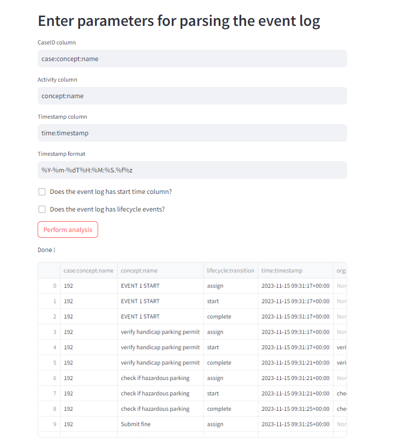
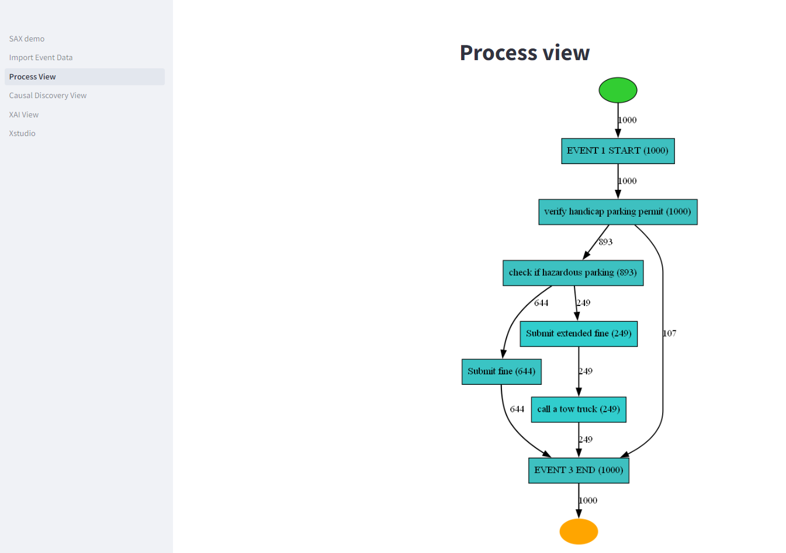
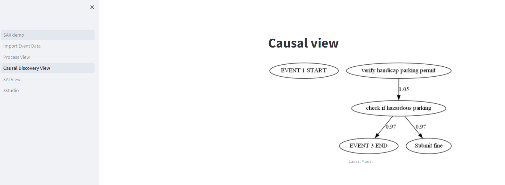

# SAX4BPM

**This is a designated Python library that aims to provide an easy and intuitive way of deriving explanations about business processes, considering multiple perspectives. Concretely, three major knowledge ingredients—a process model, a causal process model, and XAI attribute ranking—are derived and subsequently synthesized by an LLM for the construction of process and context-aware explanations, namely Situation-aware Explanations (SAX explanations).**

## Documentation

The full documentation for this repository can be found at [GitHub Pages](https://ibm.github.io/sax4bpm/).

## Introduction
The library provides three layers of business process analysis- process mining, causal discovery, XAI analysis, and LLM-powered blending of the analysis outcomes into human-readable process explanations functionality. 
We also provide a simple Streamlit UI for experimentation and discovery of the provided library functionalities.

The library allows importing process event logs in standard formats (MXML, XES, CSV) and invoking the discovery functionality of the desired layer. 

For the process perspective, we utilize the open-source PM4PY library allowing the user to invoke process mining algorithms and create a process-model representation out of the process event logs. 

We can explore the existing variants in the process model, and choose a particular variant for further analysis.

After choosing the appropriate variant we can perform causal discovery to infer the causal dependency model for the particular variant and compare it with the process model to discover discrepancies.

Finally, we can blend the discovery results using LLM-powered analysis of the different process knowledge layers, and receive answers to user queries based on this analysis.

## Related Papers

### Causal Business Processes
- F. Fournier, L. Limonad, I. Skarbovsky, Y. David, [The WHY in Business Processes: Discovery of Causal Execution Dependencies](https://arxiv.org/abs/2310.14975), arXix:2310.14975, 2024.

### Leveraging LLMs to explain Business Processes
- D. Fahland, F. Fournier, L. Limonad, I. Skarbovsky, A. J. E. Swevels, [How well can large language models explain business processes?](https://arxiv.org/abs/2401.12846), arXiv:2401.12846, 2024.
